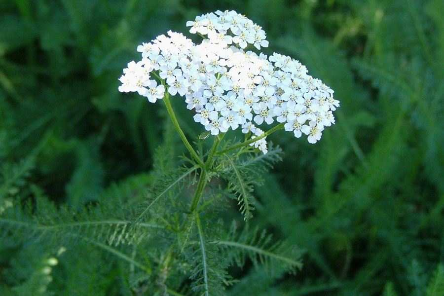

```{r setup, include=FALSE}
library(learnr)
library(mosaic)
library(vegan)
library(ggvegan)
dune <- read.csv("www/dune.csv", row.names=1)
data(dune.env)
knitr::opts_chunk$set(echo = FALSE)
```


## Introduction

### Where might we have multiple responses?
All the examples we have looked at so far have only had one response variable, 
with one or more explanatory variables. However, there can be numerous examples
where you collect lots of response variables. Examples include:

* plant species x vegetation quadrats
* gene sequence x isolate number
* invertebrate species x pitfall traps
* bacterial operational taxonomic units (OTUs) x sample
* benthic species x marine samples

These data will normally be recorded as tables, where each column is an
**attribute**, and each row is a **sample**. Therefore in the above examples,
the attributes are species, gene sequences and OTUs, whilst the samples are
quadrats, isolates, pitfall traps etc. Often these tables of data can be quite
large, for example a typical invertebrate survey can easily record 50 or 100
species within one family, whilst genetic studies can produce hundreds of
sequences. Therefore the resulting tables can produce large numbers of columns
for the attributes, as well as the rows for samples.

```{r why_multivariate}
question("Why would it be wrong to do lots of linear models, or GLMs, on these
         types of data?",
         answer("It would take too long", message = "In R you can automate 
                analyses so the time taken is not a problem."),
         answer("There might be more attributes than samples", message = "This
                might or might not be true, but is not the key issue as it does
                not affect a linear model or GLM"),
         answer("The attributes are not independent of each other, and multiple
                linear models might give misleading p-values", correct = TRUE,
                message = "Good. The attributes may well be correlated with
                each other, whilst doing lots of individual statistical tests
                is likely to result in something being significant eventually
                since p=0.05 is merely 1 in 20."),
         allow_retry = TRUE
         )
```

### Summarising your data
When you have lots of response variables, you want to have an easy method to
summarise your data, to help you interpret them. You might want answers to
questions such as:

* Which species of plants most frequently co-occur?
* Which isolates are most similar in terms of their genetic composition?
* Which bacterial genes are associated with antibiotic resistance?
* Which quadrats have few species in common?

In the past scientists used simple metrics to try and understand these types of
datasets. For example, species richness, which is the number of species that
occur in a sample. However, you can quickly see that you could have two samples
with the same number of species, but few, or even no species in common. More
sophisticated techniques calculate **diversity indices** such as Shannon diversity
and Simpson diversity. These measure both the number of species (or genes, or OTUs)
and their frequency in the sample. However, again they ignore the **identity**
of these individual attributes:

* you might have two quadrats with the same Shannon diversity but few species
in common
* you might have two isolates with similar Simpson diversity, but little overlap
in the gene sequences

### Displaying similarities between attributes and samples
A better approach is to use methods that **summarise the composition** of your
samples. By composition, we are referring to the number of species, their relative
abundance, and the taxonomic identity of those present in each sample. Likewise
if your sample is an isolate with gene frequencies, or OTUs etc. We can then
measure the **similarity in their composition** to make it easy to compare samples
or isolates.

This similarity in composition between samples can be measured on a:

* **continuous scale**, so that samples with similar composition are placed
close together, and very dissimilar samples placed far apart.
* **categorical scale**, so samples with similar composition are placed into 
different groups, classes or categories

When we measure composition on a continuous scale it is referred to as **ordination**
and when we do it on a categorical scale it is known as **classification** or
**clustering**. The two approaches can be considered complementary.

### What about the explanatory variables?
These can be used to help you interpret the results of your ordination or
classification, so that you have a proper biological understanding of what is
taking place. There are several ways of using explanatory variables. The explanatory
variables can be incorporated into an ordination: this is known as **constrained ordination**
. Where the ordination is more descriptive, and does not include explanatory 
variables, it is called **unconstrained ordination**. (There are not constrained
equivalents for classification.) We will start with unconstrained ordination
methods as these are the simplest to introduce.

## Unconstrained ordination
The first biologists to struggle with multi-attribute data were ecologists, 
because of the large numbers of species that they collected in many field surveys.
As a result, some of the methods will refer to **sites** and **species**, but
please remember that the 'sites' could just as easily be samples, isolates,
experimental plants etc., whilst the 'species' could be OTUs, gene sequences etc.

### Column and row names
For all multi-attribute (also known as multivariate) datasets R expects your
raw data to have row names, as well as column names. These can be alphnumeric,
but column names must **not** start with a number. If you save your data from
Excel in .csv (comma separated value) format, the `read.csv()` function will
assume that the first column contains row names. You will often want to keep
row and column names fairly short, so you can display them on the summary graphs
from your analyses. For example, typically species names are no longer than 8-
letter codes (4 letters genus, 4 letters species).

### Dune dataset
We are going to analyse some vegetation data from the Netherlands, which is
considered a 'classic' dataset and is used in quite a wide range of books.


This has been stored in a `data.frame` called `dune`: use the exercise box below to
get a summary of the data. How many attributes (species) are present? How many
samples (quadrats)? What seems to be a common number in the data?

```{r dune_summary, exercise=TRUE}

```
```{r dune_summary-solution}
summary(dune)
head(dune)
nrow(dune)
ncol(dune)
rownames(dune)
colnames(dune)
```

You can see that the column names (attributes) are species, for example "Achimill" is
*Achillea millefolium* :


The rownames can be numbers, which can be useful for graphical display. The dataset
contains 20 quadrats from `nrow()` and 30 species from `ncol()`. The values shown
in the `head()` function is the cover-abundance (measured on a scale of 0 to 10),
but notice how common the value 0 is in these data. This is quite common, and
known as a **sparse** dataset.

### The `vegan` package
We are going to use the `vegan` package for these analyses. It was originally
developed for vegetation analysis (hence its name), but has since been used in
a wide range of other disciplines in biology, including landscape analysis,
molecular biology etc. If looking for information on Google about the package,
remember to add the word 'multivariate' to your search, otherwise it will
return rather a lot of recipes for food!

### Different types of unconstrained ordination
There are several types of unconstrained ordination, and we will restrict
ourselves to three, that you might encounter in your Stage 3 projects.

* principal components analysis (PCA) - a linear method
* correspondence analysis (CA) - a unimodal method
* non-metric multidimensional scaling (NMDS) - ranked similarity method

Linear methods such as PCA assume a relatively constant increase or decrease
in your attribute across your samples. So if some of your samples had low soil
pH, and some high pH, the abundance of an individual species might increase or
decline in roughly a straight line. If the analysis works well, the PCA will
create new variables that 'capture' most of this change:


Unimodal methods such as CA assume that the abundance of an attribute can rise
and fall along the axis. Where data are 'sparse' this can sometimes be more
realistic for the analysis:


NMDS uses a quite different approach. It ranks the abundance values of your
attributes (species, OTUs etc) and calculates pairwise similarities. It then
tries to simplify these sets of similarities between all the original variables
into 2 new variables for easy visualisation. It can be useful when the original
data are extremely messy and difficult to interpret by PCA or CA.

## Principal components analysis
Let's analyse the dune data with PCA. The `vegan` package provides access to the
`rda()` function, which can be used with only a response variable (in which case
it defaults to PCA), or with both response and explanatory variables (when it
automatically uses constrained analysis). Remember that in both cases the "response
variable" is actually your `data.frame` containing lots of variables. The `summary()`
function on your ordination output produces lots of output (most of which you do
not need to study), so for this website I'm going to limit the output. When you
run it interactively in RStudio, you'll have to scroll up a bit to see the next
few lines.

```{r dune_pca, echo=TRUE}
# Undertake the PCA ordination
dune_pca <- rda(dune)

# First part of summary: importance of derived variables
summary(dune_pca)[["cont"]][["importance"]]
```

Creating the PCA is very simple. In a PCA you try to "squash" as much of the
variability in your data into new derived variables, known as **ordination axes**
where the first axis, **PC1** "captures" as much of the variation as possible.
The second axis, **PC2** captures as much of the remaining variation etc.

Therefore in the above output, you can see on the line labelled `Proportion Explained`
that PC1 captures 0.2947 = 29.5% of the variation, whilst PC2 captures 0.2157 = 
21.6% of the variation. Together, shown in the line labelled `Cumulative Proportion`,
they jointly capture 0.5105 = 51.1% of the variation. In other words, these two
new derived axes summarise just over half the variation in your original table of
30 attributes (species) by 20 samples (quadrats or sites). Other axes are produced,
but note that they rapidly become less important, with PC3 explaining only 9% etc.,
so usually you only look at PC1 and PC2.

### Visualising the results
PC1 and PC2 are created for both the attributes and samples, and the easiest way
to study them is via two graphs, that should be interpreted together. You can
display the results using the default `plot()` command, but the graphs are 
usually very cluttered and difficult to read. Therefore, we will use the `ggvegan`
package which has slightly better graphics that are easier to customise. This is
a "development" package, so is installed differently (this will be explained in
the practicals) but has been pre-installed for this website.

The following code displays the species scores and site scores. Remember that
depending on your experimental data, these might be OTUs and isolates respectively.
The `autoplot()` function by default puts both sites and species on the same
graph, but this can be difficult to interpret, hence the use of the `display=`
option. By default it displays sites as points, and species with arrows, but as
the site names (rownames in the original data) are simply numbers, and the
arrows can be confusing, I have set the relevant options with `geom` and `arrows`
respsectively. If you want to 'fine-tune' your plot, you can "pipe" the commands
into the usual range of `gf_` functions that you have already used.

Type ``?ggvegan::autoplot`` to see the full range of options.

```{r plot_dune, echo=TRUE}
# Display both on the same plot
autoplot(dune_pca, geom="text", arrows = FALSE)

# Display quadrat PCA scores for axes 1 and 2
autoplot(dune_pca, display="sites", geom="text", legend.position = "none") %>% 
  gf_labs(title="PC1 and PC2 of dune data showing quadrat numbers") %>% 
  gf_lims(x = c(-2,2.85), y=c(-2.4, 2.2))

# Display plant species PCA scores for axes 1 and 2
autoplot(dune_pca, display="species", arrows = FALSE, legend.position = "none") %>% 
  gf_labs(title="PC1 and PC2 of dune data showing species codes") %>% 
  gf_lims(x = c(-2,2.85), y=c(-2.4, 2.2))
```

Note that in the above code, for the two separate plots we've added a title using
the `gf_labs()` function, and also set the x- and y-axis limits via `gf_lims()`
to ensure they are on the same scale. This last step is optional: sometimes it
is useful to omit. I've also switched off the legend with `legend.position="none"`
as it's not needed for separate plots.

### Quick interpretation of the plots
Even from these simple plots you can answer some questions. See if you can work
them out:

```{r simple_pca_interpret}
question("Study the PCA plots for sites and species, and tick the true answers",
         answer("Lolium perenne (Lolipere) and Agrostis stolonifera (Agrostol)
                were rarely found together", correct=TRUE),
         answer("Quadrat numbers 10, 7 and 5 have similar species composition",
                correct=TRUE),
         answer("Quadrats 18, 9 and 4 have similar species composition"),
         answer("Poa trivialis (Poatriv) is most abundant in quadrats 2, 3, 4 and 9",
                correct = TRUE),
         answer("Alopecuris geniculatus (Alopgeni) is most abundant in quadrats
                18, 17 and 19"),
         answer("Species clustered round both 0 on PC1 and 0 on PC2 at the
                centre of the plot are fairly ubiquitous across all quadrats",
                correct = TRUE)
         )
```

Hopefully you can see that species close together in the ordination graphs
tend to co-occur, and are found mainly in the quadrats in that part of the graph.
In PCA plots you will often get a mass of overlapping species in the centre of
the plot, along the zero-zero lines: these tend to be fairly widespread and
ubiquitous species, not characteristic of any particular sites.

## Relate PCA to explanatory variables
### What do the PCA axes mean?
For most people (myself included!) one of the confusing things about PCA and
other ordination techniques is that the PCA axes do not have any units, and
you are left wondering what they really 'mean'. In essence, that is up to you to
find out, by trying to relate them to potential explanatory data. Typically you
only need to look at the first ordination axis (PC1) as this captures most of
the variation, but rarely you may want to look at PC2 as well.

### Environmental data for the sand dune vegetation
We have some environmental data for the sand dune survey stored in a `data.frame`
called `dune.env`. Examine the data in the box below:

```{r check_env, exercise=TRUE}

```
```{r check_env-solution}
summary(dune.env)
head(dune.env)
nrow(dune.env)
ncol(dune.env)
```

Notice that the `dune.env` dataset has the same number of rows as `dune`, i.e.
one entry for each quadrat sample. It does not need to have the same number
of columns. The particular variables in the `dune.env` dataset are:

* A1 = thickness of soil A1 horizon
* Moisture = ordered factor 1, 2, 4, 5
* Management = factor where BF (biological farming), HF (hobby farming), NM (nature
conservation management), SF (standard farm management)
* Use = ordered factor with levels Hayfield < Haypastu < Pasture
* Manure = ordered factor 0 to 4

Let's look at the relationship between Moisture and the PC1 scores. You can
extract the scores from your `dune_pca` object using the `scores()` function, so
to get the site (quadrat or sample) scores, use `scores(dune_pca, display="sites", choice=1)`.
The `choice=1` indicates to just extract the PC1 scores. Use this command, storing
the results in `dune_pc1` and create a boxplot against `Moisture` using `gf_boxplot()`:

```{r dune_moisture_boxplot-setup}
dune_pca <- rda(dune)
```
```{r dune_moisture_boxplot, exercise=TRUE}

```
```{r dune_moisture_boxplot-solution}
# Extract the PC1 site scores
dune_pc1 <- scores(dune_pca, display="sites", choices = 1)

# Create boxplot
gf_boxplot(dune_pc1 ~ Moisture, data=dune.env)
```

So, you can conclude that when PC1 is **high** the soil moisture content is also
relatively **high**. Now go back to your plot of the species on PC1 and PC2.

```{r which_spp_like_moisture}
question("Which species are particularly associated with wetter soils?",
         answer("Lolium perenne (Lolipere)"),
         answer("Poa trivialis (Poatriv)"),
         answer("Poa pratense (Poaprat)"),
         answer("Elymus repens (Elymrepe)"),
         answer("Plantago lanceolata (Planlanc)"),
         answer("Eleocharis palustris (Eleopalu)", correct = TRUE),
         answer("Agrostis stolonifera (Agrostol)", correct = TRUE),
         random_answer_order = TRUE
        )
```

In the same way that you have produced a graph for your Moisture, investigate
the other environmental variables against PC1. Remember, depth of the soil A1
horizon is continuous, therefore `gf_point()` is a more appropriate function.

```{r check_other_variables-setup}
dune_pca <- rda(dune)
dune_pc1 <- scores(dune_pca, display="sites", choices=1)
```
```{r check_other_variables, exercise=TRUE}

```
```{r check_other_variables-solution}
gf_point(dune_pc1 ~ A1, data=dune.env)
gf_boxplot(dune_pc1 ~ Management, data=dune.env)
gf_boxplot(dune_pc1 ~ Use, data=dune.env)
gf_boxplot(dune_pc1 ~ Manure, data=dune.env)
```

Which variables seem to have little relationship with PC1, which ones appear to
go in different directions. If you have time, try and extract PC2 scores and see
how they relate to the environment.

**Key points**

* Ordination methods provide a convenient way of summarising as much variation in
your raw data into one or two new variables.
* Samples close together on these axes will tend to have similar attributes
* It is up to you to try and understand what these axes represent by interpreting
them in relation to environmental data or laboratory experimental treatments.
