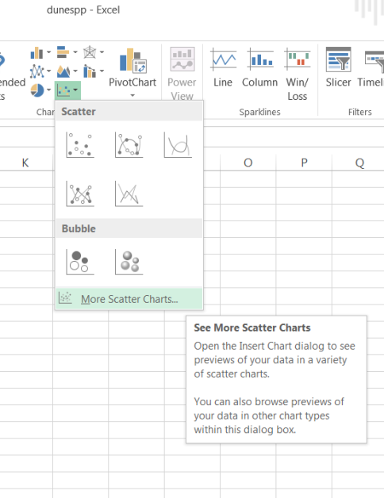
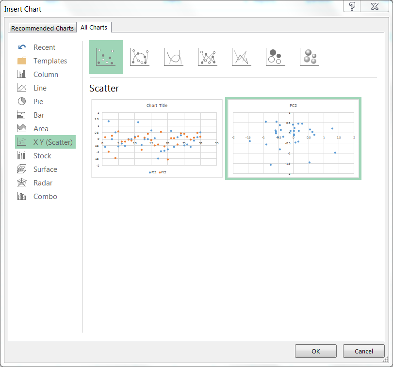
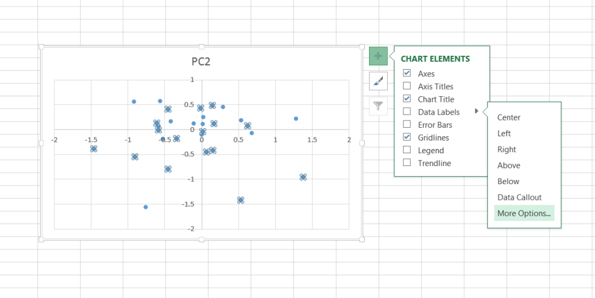
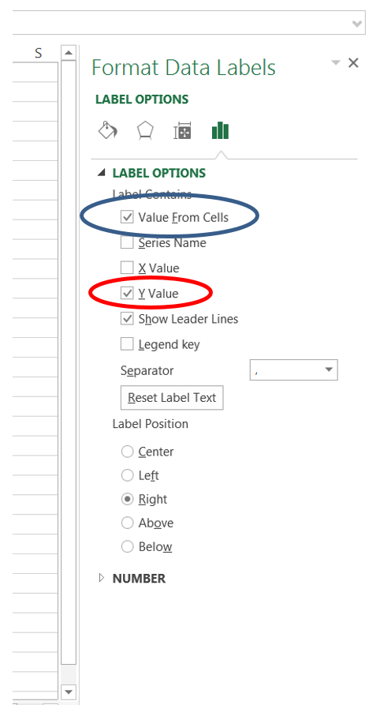
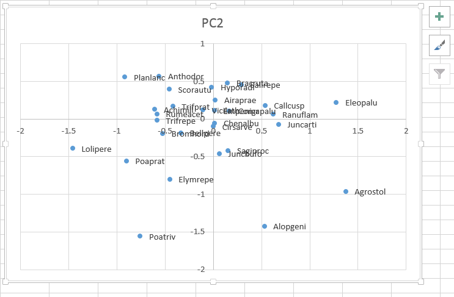

```{r setup, include=FALSE}
knitr::opts_chunk$set(echo = TRUE)
knitr::opts_chunk$set(fig.width=3.5, fig.height=3.5)
rm(list=ls())
library(tidyverse)
library(vegan)
library(grid)
```

## Aims
The main aims of this practical are to introduce you to doing multivariate statistical analyses using the add-on `vegan` analysis package to R.  The package was originally designed for vegetation analysis, but its methods are suitable for any group of organisms, from genomes to vertebrates.  You can use them to analyse any set of attributes x samples data (e.g. animal behaviours etc.)  In particular, you will learn:

* Installation and loading of add-on packages, and have a look at the online tutorial
* Undertake unconstrained ordination using PCA, CA, DCA and NMDS
* Learn how to present ordination graphs, and their biological interpretation.

## Introduction
Multivariate techniques (MVT) are of most value where you have a large number of attributes associated with each sample in your dataset.  These datasets are common in Environmental Sciences, and are often in the form of tables, for example:

* plant species x vegetation quadrats
* invertebrate species x pitfall traps
* soil chemistry x soil cores
* marine samples x benthic species 

Whilst you could analyse each species or each soil chemical variable separately, you run the risk of multiple testing (give false significant P-values).   One way around this is to analyse all your data simultaneously to provide a descriptive analysis of the similarity between samples (unconstrained ordination).  In the next practical we will look at more complex methods that test explanatory variables in simultaneously against multiple response variables.

## Before you begin
As usual, start RStudio, then create a new R Project in an empty folder. Projects have the advantage of keeping all your data files, R scripts, output graphs etc. in one place, making it easier to reproduce your research. After creating a new R Project, please create a new R Script (click on the main menu, File -> New File... -> R Script). You are recommended to keep a record of the R commands in your R script. Remember to break up your script using blank lines, and comments # so that you can easily understand it. Putting three hash symbols ### at the end of a line creates a table of contents in RStudio making it very simple to navigate your code.

**Note** There are two multivariate practical workshop exercises, and you will probably find it easiest to create a single project folder for both workshops.

## The vegan library
To install the add-on vegan library, issue the command:

```{r install vegan, eval=FALSE}
install.packages("vegan")

```

It is likely to install some additional packages in the background to supplement the vegan library; do not worry about this and they should install without problems on your drive.

There is an excellent 40-page tutorial to the vegan package written by Jari Oksanen on the Blackboard website; plus a short tutorial working through the basics of ordination.   The vegan package also works well with the labdsv package.  There is again an excellent tutorial on labdsv, at http://ecology.msu.montana.edu/labdsv/R/ which is primarily aimed at community ecology, but also covers summarising data, GLMs etc.

Before going any further please download the file `nes8010.R` from Canvas, and
move it from your Downloads folder into the R Project folder you have just created.
Next, run the following three lines:

```{r, messages=FALSE}
library(vegan)
library(tidyverse)
source("nes8010.R")
```

If you receive an error saying that `nes8010.R` cannot be found, check your R
Project folder contains the file using File Explorer (Windows) or using Finder
(Mac). You may want to check what RStudio thinks it is using as its folder by
issuing `getwd()` in the Console window. **Note**: you will need to issue these
three lines to activate the `vegan`, `ggplot2` and `nes8010` commands.

#### What is in the `nes8010.R` script?
The`nes8010.R` file contains various functions to make it easier to use R for
multi-species analysis, and produce `ggplot2`-compatible graphs. The website 
shows you the "base R" equivalent commands which are a little trickier to use.
There is a new `ggvegan` package under development which you are free to try,
but it is unstable and so its installation can cause problems. See
[https://github.com/gavinsimpson/ggvegan](https://github.com/gavinsimpson/ggvegan) for more details.

## Datasets
We will look at some community ecology data, of vegetation cover.  The example we will work with has been widely described in a large number of publications over the last 20 years, and is from a sand dune vegetation survey.  Potential explanatory data includes basic soil and management conditions.  We will also use some data collected along the causeway at St Mary's Lighthouse, but using a multivariate rather than univariate approach. Today's dataset comprises a table of sites (samples or quadrats) by species.  You may see these described as "samples" by "attributes", because multivariate techniques are not restricted only to species data.  Attributes might be biochemical composition of medicinal plants, pollution data from an environmental survey etc.  The techniques available will work with any complex "messy" multi-attribute data.

The sand dune data are example datasets from the `vegan` package: load these with the commands

```{r load dune data}
data(dune)
data(dune.env)
```

for the species and environmental data.  If you have problems loading them directly off the library, there are examples on the Canvas website that you can read into your workspace using the usual commands. Summarise the data using the `summary` command, and view the datasets on screen in the RStudio viewer.  Each row represents a different site (sample quadrat for these data) and each column a different attribute (species).  If you have multivariate data, R will expect you to provide the data in the form of rows=samples, columns=attributes.  However, it is easy to correct if you get the table the wrong way round using the t (transpose) command to swap the rows and columns.

## IMPORTANT: format of the data
Our ecological multivariate data analyses in R uses the `vegan` package which assumes you have a `data.frame` as the input type, i.e. columns are species, and rows are sites, quadrats or similar. Thus you have a `data.frame` with column names and rownames. Unfortunately `vegan` is not (yet) 100% compatible with the `tidyverse` approach. The `vegan` package expects "wide" data, so you might have to use the `pivot_wider` function  from the `tidyr`package to convert your data to "wide" format, and use the `rownames` function to add rownames. However, typically you will initially enter a big table of species x sites in Excel for ease of data entry, and if you use `read.csv` (rather than `read_csv`) it will automatically be setup correctly for use in `vegan`.

## Unconstrained ordination - PCA
PCA analysis is useful for linear unconstrained ordination; we will investigate the latter here, both are available in R.   Use the `rda` command to undertake either PCA or a constrained version, redundancy analysis (RDA) when you wish to include explanatory variables directly in the analysis.  R will *automatically undertake a PCA if you only provide one set of data* without any explanatory variables to the `rda` command.  To undertake a PCA:

```{r pca of dune data, eval=FALSE}
dune.pca <- ordi_pca(dune)
summary(dune.pca)
```
```{r pca of dune only show head, echo=FALSE}
dune.pca <- ordi_pca(dune)
head(summary(dune.pca), 1)
```

This will show a lot of information on screen, but it is the section headed `Eigenvalues, and their contribution to the variance, Importance of components` to which you should pay attention:

The summary will show you that 19 principal components have been extracted, which in total extract 100% of the variation - you will rarely look at more than the first 2 axes, PC1 & PC2. The summary indicates that your ordination has "captured" over 50% of the variation of the data on the first two axes - approximately 30% on PC1 and 20% on PC2.  Even PC3 only accounts for 10%.

Plotting of ordination graphics is difficult, as there can sometimes be too much information to display, and there is not as yet a simple method for `ggplot`.  At the end of this practical we will look at various plotting methods, including via `ggrepel` and Microsoft Excel. We will mainly focus on
using the extra plotting functions in `nes8010.R` as these are compatible with
`ggplot`.

You can plot the samples and attributes on the same graph, or separately:

```{r plots of dune pca, warning=FALSE}
ordi_plot(dune.pca)  # Probably too cluttered to see clearly
ordi_plot(dune.pca, display="sites")
ordi_plot(dune.pca, display="species")
```

Remember: in your data what we are referring to as "sites" may be different samples, whilst the "species" may be different animal behaviour patterns, or sets of chemical contaminants.  However, use the terms "sites" and "species" to obtain the plots you want. The most important species (i.e. *attributes*) in terms of differentiating between your sites (*samples*) will tend to be those with relatively high or low scores.  Species in the centre of the PCA plot are often more ubiquitous, being found in most samples, and may discriminate poorly between sites.  Sites far apart will have few species in common, those close together will be similar.  There is a trend in these data along PC1 from sites dominated by species such as _Lolium perenne_ (Lolper) and dune species such as _Elymus repens_ (Elyrep)  (e.g. sites 5, 7, 10) with higher scores on PC1 for on sites with species such as _Agrostis stolonifera_ (Agrosto) e.g. sites 12,8,13.

### Interactive labelling of plots
You will often find that the plots are difficult to read or the species labels
overlap. You can improve your plots in two ways:

1. If you use the `ordi_plot()` function (from `nes8010.R`) rather than the
default `plot()` function, you will create a `ggplot2`-compatible plot. This 
means that you can easily change its theme, axis labels etc in the usual way.
2. You can use the `ordi_identify()` function (from `nes8010.R`) to interactively
label only selected points. This is easiest to do if you store your plot in
an R object, using the `geom="point"` option for points, and then display it.
The `ordi_identify()` function can then be used with the mouse to click on the
points you wish to label. It isn't perfect (I've written it) but you might find
it useful.


```{r using_ordi_identify, eval=FALSE}
dune.pca <- ordi_pca(dune)
dune_pca_plt <- ordi_plot(dune.pca, display="species", geom="point")
dune_pca_plt   # Displays your plot
ordi_identify(dune_pca_plt) # Hit Esc key to exit
```

You can extract individual scores separately; e.g. to extract PC1 site scores
you can use the `$PC1` suffix to just get that axis.

```{r extract dune PC1}
dune.sco <- ordi_scores(dune.pca, display="sites")
```

This can be compared with some of your explanatory data, for example:

```{r ggplot boxplot of dune pc1}
ggplot(dune.env, aes(x=Moisture, y=dune.sco$PC1)) +
   geom_boxplot() +
   xlab("Soil moisture class") +
   ylab("PCA axis 1 scores") +
   theme_classic()  # Compare with theme_bw()
```

Moisture class 5 (wetter) has higher PC1 scores than moisture class 1.  __Investigate the trends in Management, Manure, depth of soil horizon (A1) and land use (Use) by plotting in similar ways__.  __Note:__ some of the variables in `dune.env` are categorical, such as soil moisture class, whereas others are on a continuous scale.  Use the `summary` command and `?dune.env` to learn more about the data.  If it is on a continuous scale `geom_boxplot` is __not__ correct.  Which `ggplot` `geom` should you use?

Remember that the impact of the explanatory variables on individual species can be evaluated by comparison with the 'species' plot of PC1 v PC2, and the positions of species at high or low extreme ends of the axis.  __Which species are associated with deeper soils (A1) or moister conditons?__

Whilst this method of doing an unconstrained analysis then comparing the scores with environmental factors is useful, you will find that including the environment in the ordination itself, via a constrained analysis, is much more powerful.  __Question:__ why might incorporating explanatory data after doing an unconstrained ordination be weaker than a constrained ordination??  (*Hint*: in regression what are the assumptions about independence between data points?) We will cover constrained ordination in the next practical.

## Arch effect in PCA
PCA is a linear ordination method - if there is a large amount of species turnover (i.e. many sites with few species in common) one result is the "horseshoe" or "arch" effect in the plots.

This can sometimes be corrected by rescaling or standardising the data before analysis, or by using an alternative analytical method. Common ones include unimodal techniques such as correspondence analysis (CA) and detrended correspondence analysis (DECORANA or DCA), or non-metric methods such as non-metric multidimensional scaling (NMDS).  There has been criticism that DCA is sometimes too severe in its attempt to remove the arch effect, so we will focus on CA and NMDS.  If you wish to use DCA, it is available in vegan as under the `decorana` command, but today we will focus on CA and NMDS.

We will use another built-in dataset available from the vegan package: varespec.  This describes different species of lichens in reindeer-grazed pastures in Scandinavia (use ?varespec for details about the data).  Begin by doing a PCA and note the "arch" effect:

```{r load varespec}
data(varespec)
```

(As usual you can inspect the data in the RStudio viewer to see the dataframe).

```{r pca of varespec for printing, echo=FALSE}
varespec.pca <- ordi_pca(varespec)
head(summary(varespec.pca),1)
```
```{r pca of varespec for handout, eval=FALSE}
varespec.pca <- ordi_pca(varespec)
summary(varespec.pca)
```

As usual, the `summary` command produces a lot of output: focus on the percentage of variation explained by PC1 and PC2.  This suggests almost 80% of the variation (0.7927) in the dataset has been explained by the PC1 plus PC2; always be suspicious when the explained variation is so high in a PCA.  Another problem is immediately apparent when you plot the site scores, which are in the shape of a distinct "arch":

```{r plot of varespec.pca}
ordi_plot(varespec.pca, display="sites")
```

## Correspondence Analysis (CA) & non-metric multidimensional scaling (NMDS)
This arch effect can sometimes be reduced by CA, DCA or NMDS.

### Correspondence analysis
Correspondence analysis is a **unimodal** equivalent to PCA; its main difference
is that it assumes the abundance of species rises and falls along each ordination
axis, rather than changing in a roughly straight line. If using the basic
`vegan` functions it is available via the `cca` function, but for greater
consistancy there is a wrapper function in `nes8010.R` for it called `ordi_ca()`

```{r correspondence analysis for printing, echo=FALSE}
varespec.ca <- ordi_ca(varespec)
head(summary(varespec.ca),1)
```
```{r correspondence analysis for handout, eval=FALSE}
varespec.ca <- ordi_ca(varespec)
summary(varespec.ca)
```

The percentage variation explained by the first two axes (42.33 %) is now more typical of an ordination of ecological data.  To confirm that the arch effect has been removed plot the samples; interpretation of species is the same as for PCA:

```{r plot correspondence analysis, eval=FALSE}
ordi_plot(varespec.ca, display="sites")
ordi_plot(varespec.ca, display="species")
```

Remember, if you want to interactively identify points on your graphs, you can
use the `geom="point"` option, save the plot, and then `ordi_identify()`.

### Non-metric multidimensional scaling
NMDS uses a different approach to fit an ordination, and is more concerned with the relative ranking of samples along the ordination axes, rather than the actual distances between them.  It uses a different analytical approach to come to a solution, which may involve rescaling the data.  The vegan library has the `metaMDS` function which automates many of the issues.  As it uses an iterative method to come to a solution, your output is likely to differ slightly from mine, but this is the output that I obtained. For consistencty
in function naming, you may find it easier to call with `ordi_nmds()`:

```{r NMDS of varespec}
varespec.nmds <- ordi_nmds(varespec)
```

Here the command has decided that the best solution is to standardise the data before the NMDS.  NMDS only returns 2 axes and does not provide a measure of how much variation is explained by these compared to the other axes (since there are not any other axes to compare with).  The "stress" value from the analysis is usually reported; the lower the stress the better the NMDS.  However there is not a single stress value which might be viewed as "good" or "poor". Instead if you were to do several NMDS analyses (e.g. with different transformations of the raw data) you would select the one with the lowest stress.  Fortunately R automatically selects the best transformation for your raw data.  

To plot the results you also need to specify the `type="text"` option to display the text on the graphs:

```{r plots of NMDS}
ordi_plot(varespec.nmds, display="sites", geom="text")
ordi_plot(varespec.nmds, display="species", geom="text")
```

The lower the stress value, the better the NMDS ordination has been at capturing the original multivariate data into 2 dimensions.  It is often useful to create a "stressplot" (also known as a "Shepard diagram") after an NMDS to understand how well it has fitted the data; ideally the data should form an approximately straight line scatter:

```{r Shepard diagram}
stressplot(varespec.nmds)
```

You can check how well individual sites or species have been fitted in the ordination in NMDS (and other ordination techniques) using the goodness of fit commands.  The bigger the circle the better the fit:

```{r goodness-of-fit graphs}
gof <- goodness(varespec.nmds)
plot(varespec.nmds, display="sites", type="text")
points(varespec.nmds, display="sites", cex=gof*100)
```

### Detrended correspondence analysis
The `decorana` command can be used for DCA; you might want to try this in your
own time after today's practical, and compare the graphs for PCA, CA, DCA and NMDS.
However, generally NMDS is recommended rather than DCA but you will see the 
latter in many older scientific papers.

# Ordination graphics
Good graphical display is essential to help you interpret your ordination results. Here we look at interactive labelling of points in R, the use of the `ggrepel` package, or exporting results back to Excel.
Some of the graphs you have used are with additional functions (in `nes8010.R`)
to make it easier to interface with `ggplot2`.

### Using ggrepel for your ordination graphs
The additional package `ggrepel` is very useful to reduce labels overlapping:

```{r ggrepel for handouts, eval=FALSE}
install.packages("ggrepel")
library(ggrepel)
```
```{r ggrepel not printed, echo=FALSE, warning=FALSE}
library(ggrepel)
```

You will need to extract your ordination scores from your ordination output; here we will again look at the species scores.  Unfortunately the default return from the `scores` command is a matrix and `ggplot` expects a data.frame (data.frames and tibbles are more versatile for plotting). The `ordi_scores()` function from `nes8010.R` should do the conversion automatically:

```{r extract spp scores for ggplot}
# Base R
# dunespp.sco <- data.frame(scores(dune.pca, display="species"))

# ordi_scores from nes8010.R
dunespp.sco <- ordi_scores(dune.pca, display="species")
```

We can use ggplot in the usual way, building up layer by layer, but take advantage of extra commands provided by `ggrepel` to reduce overlap between labels. If you look in your `dunespp.sco` object you will see all the species names (or site names if requested) are in a column called `Label` which you use to label your points:

```{r ggplot and ggrepel of dune.pca, warning=FALSE}
ggplot(dunespp.sco, aes(x=PC1, y=PC2, label=Label)) +
   geom_point() +
   geom_text_repel() +
   theme_classic()
```

If this is still too crowded, you can drop the labels for certain species, such as _Empetrum nigrum_ in the centre of the plot.  You'll find it easier if you convert your PCA scores into a tibble so that you no longer have to refer to `rownames` and can use the `filter` command to filter out any rows you don't want.  The `!=` symbol means "not equal to". Remember that in any ordination diagram, species near the centre of the plot tend to be relatively ubiquitous and found in most samples, whereas those nearer the edge will be of more ecological interest, as they occur in some samples, but not in others.

```{r dune minus Empenigr, warning=FALSE}

ggplot(filter(dunespp.sco, Label != "Empenigr"), aes(x=PC1, y=PC2, label=Label)) +
   geom_point() +
   geom_text_repel() +
   theme_classic()
```

If you wanted to drop both _Empetrum nigrum_ and _Rumex acetosa_ it is usually easiest to have them in a list and precede Label with `!` (for "NOT") and use the `%in%` operator:

```{r drop 2 spp from plot, warning=FALSE}
ggplot(filter(dunespp.sco, !Label %in% c("Empenigr", "Rumeacet")),
       aes(x=PC1, y=PC2, label=Label)) +
   geom_point() +
   geom_text_repel() +
   theme_classic()
```

### Exporting ordination scores to Excel
Whilst R gives a lot of control on plotting, it may require extra coding or new commands to learn.  Some students prefer to export data to Excel and use its plotting facilities.  This shows you how to produce a species PCA plot, based on your original dune dataset; you can use the same method for samples plots.

**Note**: It is always much better to try and create your plots in RStudio
rather than Excel. Using RStudio gives you a completely **reproducible** way
of generating plots automatically. Excel relies on click-and-point mouse and
menus, and so is less reliable. The following advice should merely considered
as optional should you wish to use Excel.

If you have not already done so, first make sure that RStudio is looking in your
BIO8010 folder by selecting:

__Session -> Set Working Directory -> Choose Directory.__

and choosing the correct folder.  Then extract the __species__ scores for both PC1 and PC2, and then write them to a CSV file.

```{r spp scores for pc1 pc2 dune}
dunespp.sco <- ordi_scores(dune.pca, display="species")
write.csv(dunespp.sco, "dunespp.csv")  # Use write.csv rather than write_csv
```

If you go to your NES8010 folder in File Explorer for this project you should see the file `dunespp.csv` listed; depending on your Microsoft Windows configuration, it might only be listed as `dunespp`.  Double-click on it and by default it will open in Microsoft Excel.  After the data are loaded, you need to insert a chart.

Click on the __Insert__ tab, select __Scatter__ and choose the __More Scatter Charts...__ option as shown below:



Under the __XY (Scatter)__ option, ensure that you pick the option that gives you a true x and y graph, on the right:



Click OK to insert the graph.

Finally to add species labels to this graph, click once on one of the points in the graph to select all the points, and click on the large + symbol to the right of the graph.  This gives you access to various options, click on the arrow to the right of Data Labels as shown below, and select __More Options...__



This allows you to select column A as the range for your species labels.  Click on __Values from Cells__, highlighted in blue in the diagram below:



This will produce a pop-up window called __Data Label Range__. Select the list of species names in column A (ignore the blank A1 cell) in cells A2:A31 and click OK.  Unclick __Y value__ (shown in red above) to stop the PC2 numbers being displayed.  Your graph should now look similar to the following:



Where species names overlap it is easy in Microsoft Excel to move them with the mouse, change font size or font colour etc.  Of course you will also want to change the chart title from the default of PC2 to something more sensible.  The main problem with Excel is that it involves export/import and lots of mouse-clicks, and so can be harder to remember.

